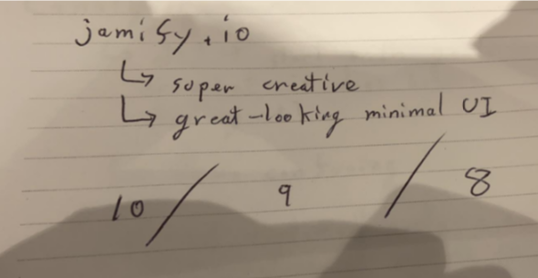
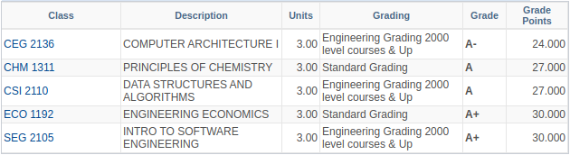

Before my transition into a new decade, I previously made some goals to accomplish in the fourth quarter of 2019. Specifically, my primary target was to:

 > Produce stellar grades, develop a non-technical hobby, and launch my first side-project.

Diving deeper, I really only had 5 specific goals I wanted to focus on.

|Key result|Status|Progress|
|-|-|-|
|Learn guitar|Finished|100%|
|Jamify|In progress|30%|
|8.0+ term cGPA|Finished|100%|
|Read 3 books|In progress|33%|
|1800 elo on Leetcode|Finished|100%|

Average: 72.6% completion

## Learning Guitar

I am happy to finally pick up the guitar. My guitar has a bit of history on my former self. To provide some context, I purchased a guitar back when I was 15, but never really dived deep as I was impatient and stubborn. I filled myself with excuses believing that it was just to painful to play. A tragedy. Now that I am 20, my mentality has changed, and I am a different person. Specifically, the guitar I had purchased had never changed, but it was I that changed through time (Heraclitus reference!). I have consistently practiced 30 minutes - 1 hour almost every day and the results have shown. I still have a long way to go, but as of now, I am able to play a couple songs.

Now, the reason why I wanted to pick up a non-technical hobby is mostly because I am too absorbed with coding. It is unhealthy and unsustainable for myself to continuously code during the day at work and during the night (leetcode + side projects). As such, it was essential to invest myself into something I can enjoy. Playing the guitar has taught me a new sense of freedom (music in general). Specifically with learning the guitar, I have taught myself to enjoy the process, and not the results. This concept was taught to me by one of my co-workers at Google. His hobby was painting, and although he never claimed to be good at it, the reason he painted was not to create a masterpiece, but rather enjoy the process and its joys in doing so. This is what I wanted. Regardless of how others perceive it to be, my enjoyment of playing the guitar is mine alone.

## Jamify

A complete failure. What started off with incredible velocity, ended up grinding to a halt. Looking back, this definitely could have been done if my time management was better. I say this because this project requires large volumes of attention at a time. For example, if I had an hour to spare, I would focus on a different task. However, if I had 2+ hours to spare, then I would jump in. The reason is because by the time I familiarize myself with the codebase, my time has been exhausted. I still have plans to finish this, and will have to discipline myself to push this out. On a side note, I was able to demo Jamify v1 at CUSEC 2020 and received some motivational comments!

## 8.0+ term cGPA

Coming back to school from a whole year of working, I wasn't sure if I could perform like before. In the beginning I was struggling with the transition, forgetting many deadlines and scoring low on midterms. I was afraid this goal would not be accomplished, but through enough discipline, I remembered how to study effectively and was able to bring one of my lowest courses from a D- to an A+ (He dropped the lowest midterm). I am a little disappointed in only achieving an A in CSI2110. I definitely could have received an A+ had spent more time studying. One of my surprises was chemistry, which I had anticipated to get an A-, but somehow managed to get an A instead.

Overall, I am incredibly happy with the results, especially since my cGPA had gone up from 9.0, to 9.07. This also places me eligible for the dean's list this semester and will plan to continue the performance until graduation.

## Read 3 books

Another failure. I was only able to read one book, Algorithms to live by. Throughout my entire life, I have always been a poor reader. This is mostly because I have a relatively short attention span. I was hoping to fix that, but once again a lack of discipline has strayed me away from completing this goal. Reflecting on this, perhaps I need to find a new medium for knowledge, audiobooks / podcasts? I'll explore this in the coming year.

## 1800 elo on Leetcode

Starting at a base elo of 1500, over the period of q4, I peaked at 1869 and ended up at 1784. After participating in a couple of these contests, I am amazed at the times the professionals can accomplish. At an elo of 1784, this puts me at the top 10%, which I believe is expected. I don't consider myself a genius, but I think with enough experience, I can hold myself at the top 5% consistently.

One of the things I am grateful for is having a roommate to participate in these contests with me. It provides not only motivation, but the opportunity to discuss results after the contest. For example, we can see how our approaches differ and why we were not able to get to an optimal solution.

| # | Score | Ranking | ELO |
| -------------------------------------------------------- | ----- | ----------- | ---- |
| [b16](https://leetcode.com/contest/biweekly-contest-16)  | 12/19 | 688 / 2788  | 1784 |
| [w168](https://leetcode.com/contest/weekly-contest-168)  | 3/20  | 2599 / 5525 | 1772 |
| [w163](https://leetcode.com/contest/weekly-contest-163)  | 7/20  | 1855 / 5873 | 1838 |
| [b13](https://leetcode.com/contest/biweekly-contest-13)  | 21/21 | 168 / 2771  | 1869 |
| [w162](https://leetcode.com/contest/weekly-contest-162)  | 7/18  | 1951 / 6058 | 1776 |
